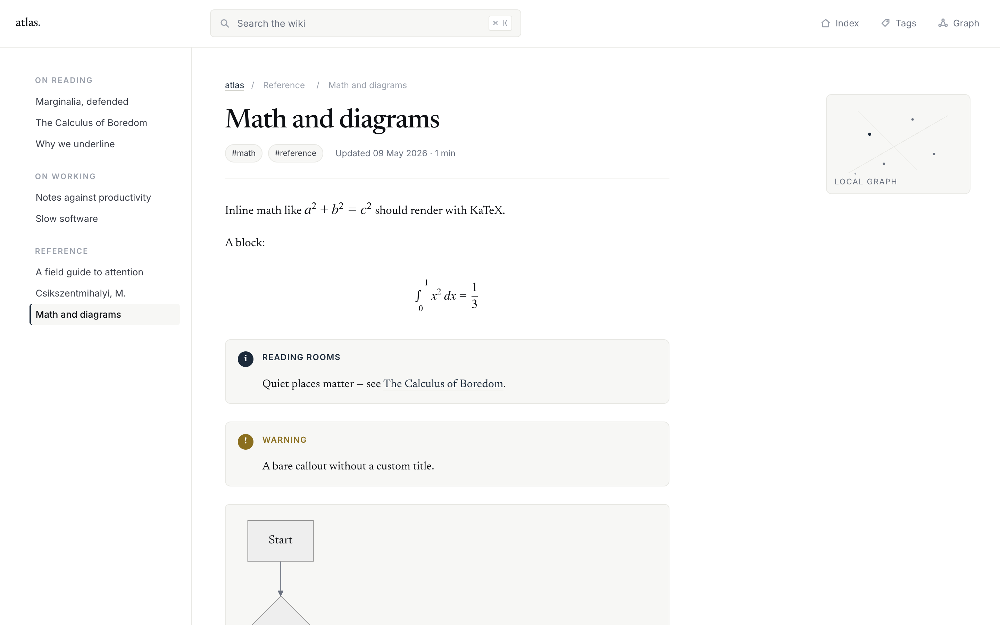
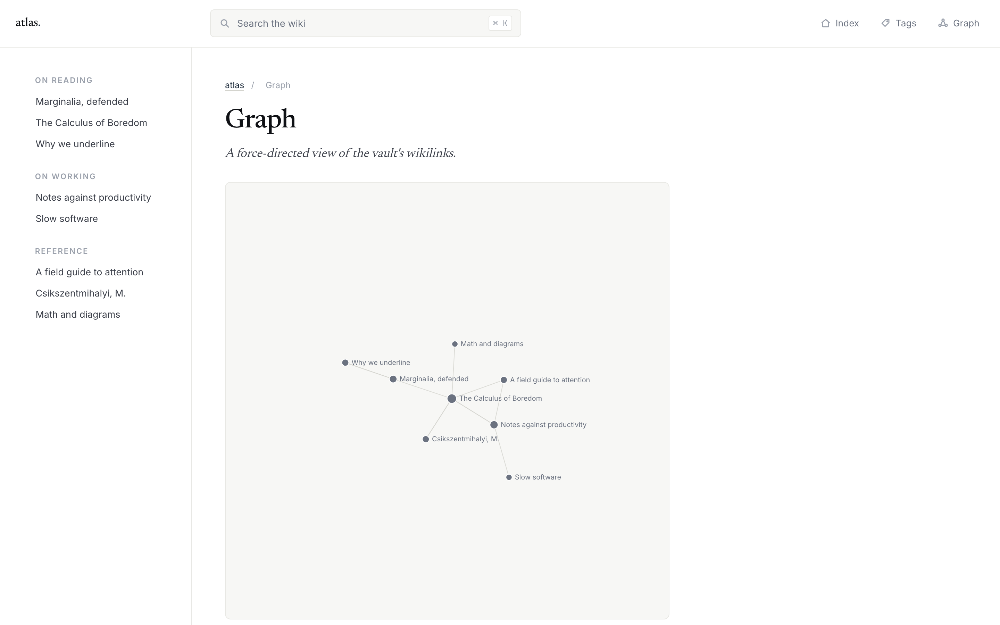
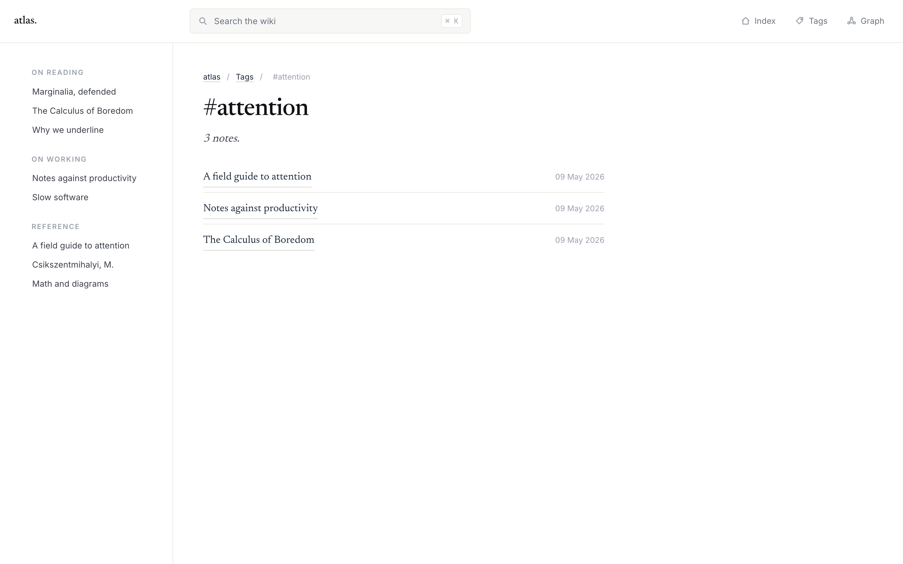

# HTML Wiki for Obsidian

A community plugin that turns any Obsidian vault into a browsable HTML wiki, in
real time, with no export step.

Enable the plugin and your vault becomes viewable at
`http://127.0.0.1:8484/`. Files added or edited in Obsidian appear or update in
the wiki immediately. No publish command, no remote server, no folder to manage.



## Why

This is **not** Obsidian Publish. There is no remote host, no account, no sync.
The wiki runs locally and is reachable only from your own machine unless you
explicitly forward the port. It is designed for the moments you want a
distraction-free, link-aware reading view of your own notes — at your desk, on
your couch, on a second monitor — without leaving Obsidian as the source of
truth.

## Features

- Live HTML view of your whole vault. Edit a note, refresh the browser tab.
- **Wikilinks**, embeds, callouts, KaTeX math, Mermaid diagrams, footnotes, and
  task lists. Internal links resolve to slug URLs; unresolved links degrade
  gracefully.
- **Backlinks** and an **on-this-page TOC** in the right rail.
- A **force-directed graph** of the entire vault.
- **Full-text search** with `⌘K` (Ctrl+K on Linux/Windows) — popover hits or a
  dedicated `/search/` page.
- A typographic theme — Quiet Reference — that does not look like AI defaults.
  Newsreader serif body, Inter chrome, JetBrains Mono code; deep ink-blue
  accent; no purple, no gradient buttons, no shadcn cards, no emoji icons.
- **Privacy-aware**: notes with `publish: false` in frontmatter (or whatever
  key you configure) are hidden from the index, search, graph, backlinks, and
  direct URL access.

## Install

### Manual install

1. Download `manifest.json` and `main.js` from the latest release.
2. Place them in `<vault>/.obsidian/plugins/obsidian-html-wiki/`.
3. Open Obsidian → Settings → Community plugins → reload, then enable
   **HTML Wiki**.

### Via BRAT (once published)

When the plugin is added to the community plugin store you'll be able to
install it through *Settings → Community plugins → Browse → "HTML Wiki"*. In
the interim, [BRAT](https://github.com/TfTHacker/obsidian42-brat) can install
it directly from this repository.

## Usage

Once enabled:

- A status-bar item shows the live URL: `● wiki: 127.0.0.1:8484`. Click it to
  open the home page.
- The book-icon ribbon button does the same.
- Two commands are registered:
  - **HTML Wiki: Open vault home in browser** — always available.
  - **HTML Wiki: Open this note in browser** — opens the active note's URL.
- Settings (Settings → Community plugins → HTML Wiki):
  - **Port** (default `8484`, must be 1024–65535).
  - **Frontmatter exclusion key** (default `publish`).
  - **Exclusion value** (default boolean `false`).
  - **Bind to all interfaces** — off by default; flips the listen address from
    `127.0.0.1` to `0.0.0.0` for LAN reading. A warning appears when on.
  - **Restart server** / **Open vault** / live address & excluded-count lines.





## Privacy

- The plugin runs an HTTP server only on `127.0.0.1` by default. Loopback only;
  nothing on your network can reach it.
- "Bind to all interfaces" opts in to listening on `0.0.0.0` for LAN sharing.
  The setting shows a warning. Use only on networks you trust.
- No telemetry. No outbound requests are made by the plugin or the server.
  Google Fonts (Newsreader, Inter, JetBrains Mono) are loaded by the *browser*
  when you visit a wiki page; if you'd rather they not, your browser is the
  place to block that.
- Notes with the configured exclusion frontmatter key are filtered from the
  site index, search, graph, backlinks, and direct URL access.

## FAQ

**The port is in use.** The server retries five consecutive ports starting
from your configured port. If all six are taken the plugin surfaces a notice.
Pick another port in settings and use **Restart server**.

**Mobile?** Not supported in v1 — the plugin is desktop only
(`isDesktopOnly: true`).

**Dataview / Templater queries?** Not rendered. Pure markdown features only.
Code blocks for those languages display as plain code.

**My note links don't resolve.** The wiki uses Obsidian's lookup conventions:
`[[Page]]`, `[[Page|Alias]]`, `[[Folder/Page]]`, `[[Page#Heading]]`, and
`![[image.png]]` for embeds. If a target points to a hidden note (excluded by
frontmatter), the link will render as unresolved — by design, to preserve
privacy.

**Why does the graph view feel slow on a large vault?** The graph payload is
computed on demand, and the simulation runs in the browser. For vaults of
several thousand notes, expect a one-second settle.

## Development

```sh
npm install
npm run build      # type-check + bundle
npm test           # vitest run
npm run dev        # esbuild --watch
```

The repository is laid out per the official Obsidian community plugin template
(`obsidianmd/obsidian-sample-plugin`). Tests use `vitest` against a synthetic
fixture vault under `tests/fixtures/sample-vault/`.

Architecture is documented in [`docs/SPEC.md`](docs/SPEC.md).

## License

MIT — see [LICENSE](LICENSE).
