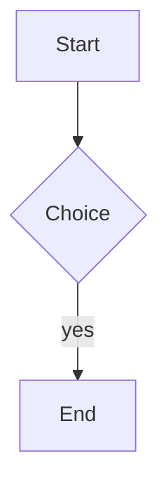

# Math and diagrams

Inline math like $a^2 + b^2 = c^2$ should render with KaTeX.

A block:

$$
\int_0^1 x^2 \, dx = \frac{1}{3}
$$

> [!note] Reading rooms
> Quiet places matter — see [[Boredom]].

> [!warning]
> A bare callout without a custom title.

A task list:
- [x] write the spec
- [ ] ship it
